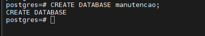
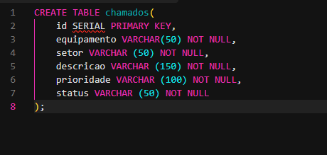
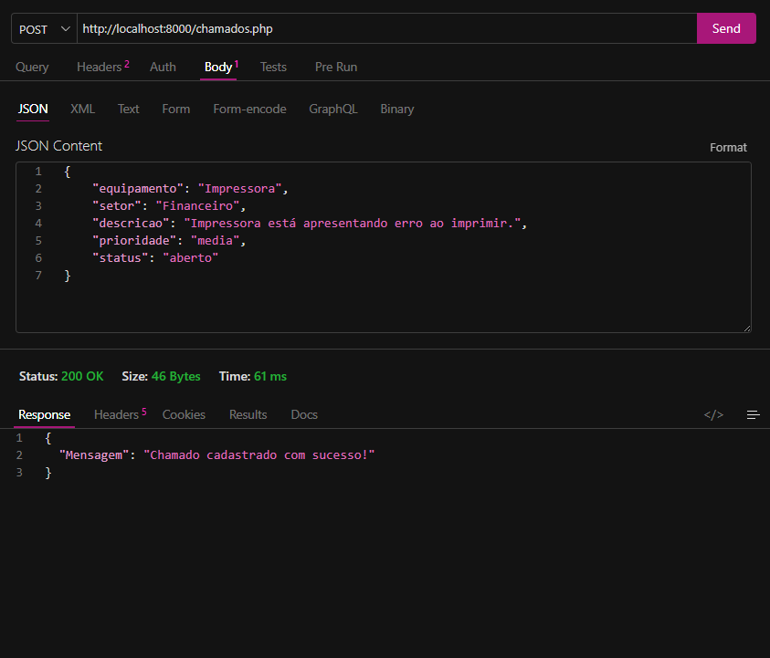
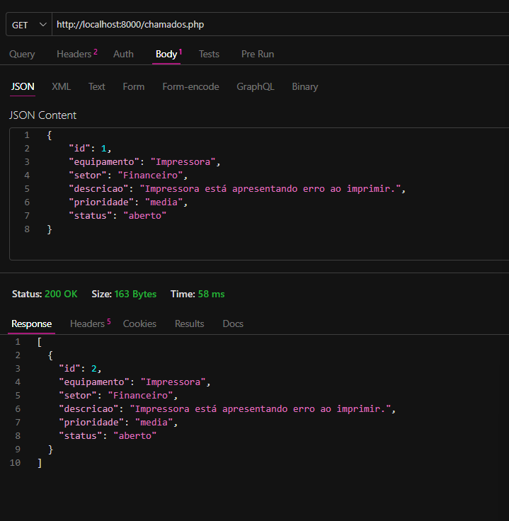
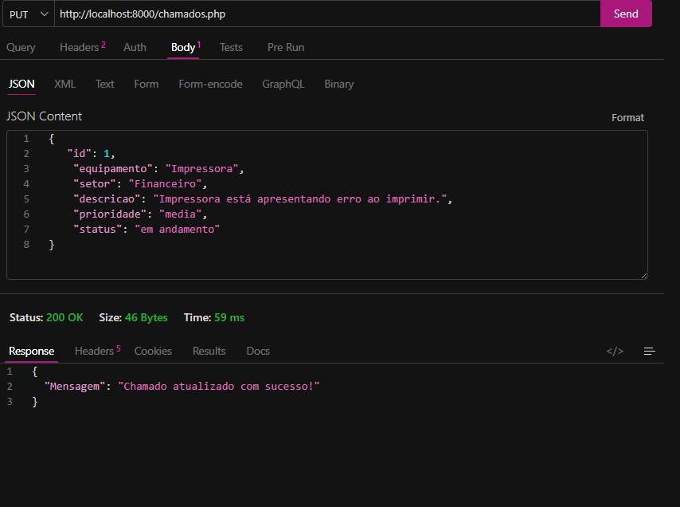
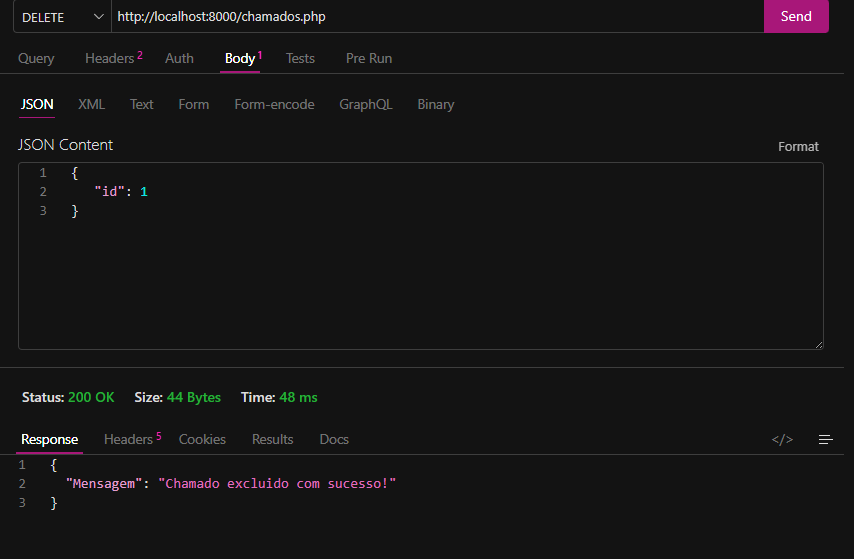

## Atividade 09 

#### Banco de Dados
> Criação do Banco de Dados chamado `manutencao`

#### Tabela
> Criação da tabela chamada `chamados`

#### POST
> O método `POST` é usado para *cadastrar/criar* um novo chamado na API.

#### GET
> O método `GET` é usado para *buscar/listar* os chamados cadastrados.

#### PUT
> O método `PUT` é usado para *atualizar* um chamado que já existe, usando o `id`.

#### DELETE
> O método `DELETE` é usado para excluir um chamado, também usando o `id`.

